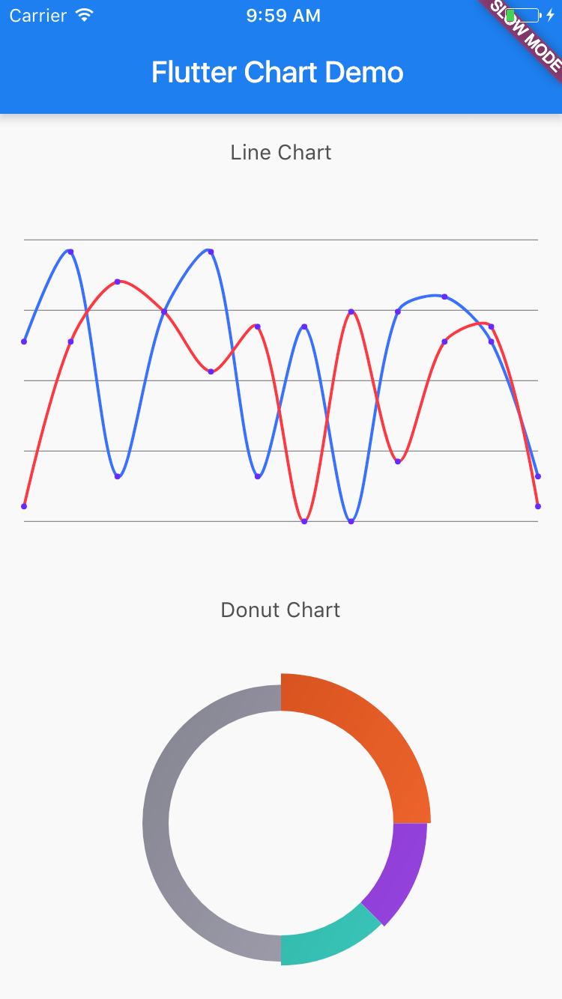

# Flutter Chart

A simple chart library for Flutter (https://flutter.io). 

**Important: This package is at very early development stage. If you are 
interesting in contributing to the project, fork and send us your PRs.**

## Getting Started

```dart
var lineChart = new LineChart(
    data: new LineChartData(
      dataSets: <DataSet>[
        new DataSet(
          label: "Data Set 1",
          data: new List<Entry>.generate(
              20, (i) => new Entry(random.nextInt(20) * 10.0)),
        ),
        new DataSet(
          label: "Data Set 2",
          data: new List<Entry>.generate(
              20, (i) => new Entry(random.nextInt(20) * 10.0)),
        ),
      ],
      lineColors: <Color>[
        const Color(0xFFFF22FF),
        const Color(0xFF00FFFF),
      ],
    ),
  );

var donutChart = new DonutChart(
   data: new DonutChartData(
     dataSets: <DataSet>[
       new DataSet(
         label: "Data Set 1",
         data: <Entry>[
           new Entry(25.0),
           new Entry(12.5),
           new Entry(12.5),
           new Entry(50.0)
         ],
       ),
     ],
     colors: <Color>[
       const Color(0xFFFF8540),
       const Color(0xFFB269EE),
       const Color(0xFF4AD8CF),
       const Color(0xFFBDBCC8),
     ],
   ),
 );

```

## Screenshots


